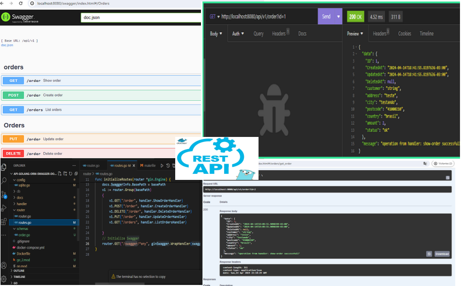
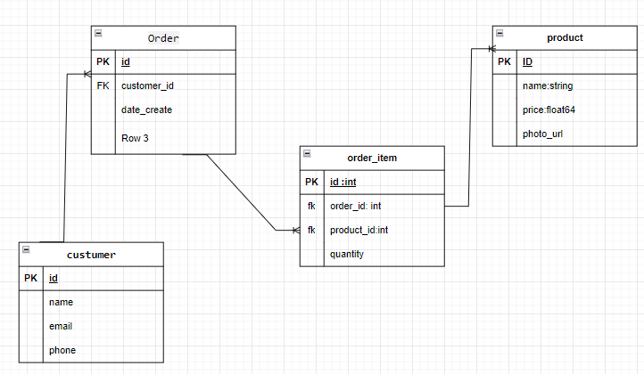
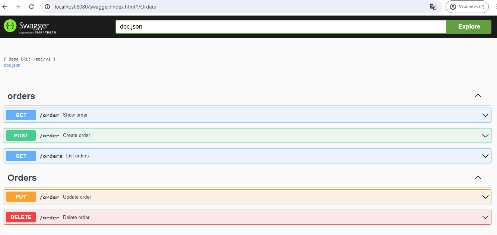

# API in Go with ORM, Swagger and Docker

<!---Esses são exemplos. Veja https://shields.io para outras pessoas ou para personalizar este conjunto de escudos. Você pode querer incluir dependências, status do projeto e informações de licença aqui--->






> About Repository showcasing a Go API with ORM, Swagger, and Docker. It leverages the Gin framework, GORM for ORM, and Swag for documentation. Docker streamlines development and deployment.

## Requirements:
   
 Develop an API in Go using an ORM (Object-Relational Mapping) for interaction with the database,
 where it will be possible to perform CRUD (Create, Read, Update, Delete) operations on the entities 
 Client, Product, Order, and OrderItem. The API should be documented using Swagger to facilitate 
 understanding and integration by developers. Additionally, the system should be containerized using 
 Docker to ensure portability and ease deployment in different environments.

### Adjustments and improvements

The project is still under development and the next updates will be detailed in the following tasks:
Create a small goang + Angular app for orders management


 ## API implementation
- [x] Create rotes(restFull)  
- [x] Configuration package configuration
- [x] Add ORM
- [x] Add swagger API documentation
- [x] API dockerization
- [ ] Conectar API com o postgresql

## Front-end Implementation with Angular 
- [ ] List orders in a table
- [ ] Add pagination (10 orders/page)
- [ ] Allow users to cancel an order (persist the change in db)
- [ ] Allow users to search for orders by customer or status
 
## 💻 Prerequisites

Antes de começar, verifique se você atendeu aos seguintes requisitos:

* Você instalou a versão mais recente do `go1.22.2`
* Você tem uma máquina `<Windows / Linux / Mac>`. Indique qual sistema operacional é compatível / não compatível.
* Você leu `<guia / link / documentação_relacionada_ao_projeto>`.

## 🚀 Instalando <api-golang-orm-swagger-docker>

Para instalar o <api-golang-orm-swagger-docker>, siga estas etapas:

Linux e macOS:
## DOCKER 


## install swag

 go get -u github.com/swaggo/swag/cmd/swag


```
<api-golang-orm-swagger-docker>
```

Windows:
```
<api-golang-orm-swagger-docker>
```

## ☕ Usando <api-golang-orm-swagger-docker>

Para usar <api-golang-orm-swagger-docker>, siga estas etapas:

```
consumindo  a API
```
## Swaggaer


## Insominia


## 📫 Contribuindo para <api-golang-orm-swagger-docker>
To contribute to<api-golang-orm-swagger-docker>, siga estas etapas:

1. Fork this repository.
2. Create a branch: `git checkout -b <branch_name>`.
3. Make your changes and commit them: `git commit -m '<mensagem_commit>'`
4. Push to the original branch: `git push origin <api-golang-orm-swagger-docker> / <local>`
5. Create the pull request.

Alternatively, see the GitHub documentation at [how to create a pull request](https://help.github.com/en/github/collaborating-with-issues-and-pull-requests/creating-a-pull-request ).
## 🤝 Colaboradores


## 😄 Become one of the contributors<br>

Do you want to be part of this project? Click [HERE](CONTRIBUTING.md) and read how to contribute


## 📝 License

This project is under license. See the [LICENSE](LICENSE.md) file for more details.

[⬆ Back to top](#api-golang-orm-swagger-docker)<br>

